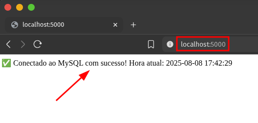

<div align="center">
  <br>
  <h3>Configuração de Ambiente com Docker Compose</h3>
</div><br>

[Desafio](https://github.com/andrrade/Desafio02-DevOps-Rocketseat/blob/main/desafio.md)

---

## Estrutura do Projeto

| Arquivo              | Descrição                                                                                           |
| -------------------- | --------------------------------------------------------------------------------------------------- |
| `Dockerfile`         | Define a imagem da aplicação Flask, baseada em Python Alpine.                                       |
| `docker-compose.yml` | Configura os containers do banco MySQL e da aplicação Flask, volumes, rede e variáveis de ambiente. |
| `app.py`             | Código da aplicação Flask, conecta no MySQL e retorna a hora atual.                                 |
| `requirements.txt`   | Lista as dependências Python (flask, mysql-connector-python, python-dotenv).                        |
| `.env`               | Arquivo contendo variáveis de ambiente para configuração da aplicação.                              |

---

## Explicação dos Arquivos

### `.env`

```
DB_HOST=127.0.0.1
DB_USER=laura
DB_PASSWORD=senha123
DB_NAME=meubanco
```

* Este arquivo armazena as variáveis de ambiente usadas pela aplicação para conectar no banco de dados.
* Permite separar as configurações sensíveis e específicas do ambiente do código-fonte.
* No seu projeto, o arquivo `.env` é carregado pela biblioteca `python-dotenv` dentro do `app.py` com o comando `load_dotenv()`.
* As variáveis aqui definidas são acessadas dentro do código Python usando `os.getenv("VARIAVEL")`.
* **No ambiente Docker Compose, essas variáveis são sobrescritas pelas variáveis definidas no próprio `docker-compose.yml`**, que são as que realmente vão ser usadas dentro do container.

---

### Dockerfile

```Dockerfile
FROM python:3.12-alpine

WORKDIR /app

COPY . .

RUN pip install --no-cache-dir -r requirements.txt

CMD ["python", "app.py"]
```

* Cria a imagem da aplicação baseada no Python Alpine.
* Copia o código fonte e instala as dependências.
* Executa a aplicação.

---

### docker-compose.yml

```yaml
version: "3.8"

services:
  db:
    image: mysql:8
    container_name: mysql-dev
    environment:
      MYSQL_ROOT_PASSWORD: root123
      MYSQL_DATABASE: meubanco
      MYSQL_USER: laura
      MYSQL_PASSWORD: senha123
    volumes:
      - mysql_data:/var/lib/mysql
    networks:
      - minha_rede
    ports:
      - "3306:3306"

  app:
    build: .
    container_name: minha_app
    environment:
      DB_HOST: db
      DB_USER: laura
      DB_PASSWORD: senha123
      DB_NAME: meubanco
    depends_on:
      - db
    networks:
      - minha_rede
    ports:
      - "5000:5000"

volumes:
  mysql_data:

networks:
  minha_rede:
    driver: bridge
```

* O serviço `db` configura o container MySQL com usuário não-root e volume persistente para dados.
* O serviço `app` é a aplicação Flask que consome as variáveis de ambiente para conectar ao banco.
* Note que no `app` o valor `DB_HOST: db` corresponde ao nome do serviço `db` dentro da rede Docker, permitindo a comunicação.
* Variáveis de ambiente no `docker-compose.yml` sobrescrevem o `.env` quando os containers estão rodando.
* O volume `mysql_data` garante que os dados do banco persistam mesmo após o container ser removido.
* A rede `minha_rede` isola e conecta os serviços.

---

### app.py

```python
from flask import Flask
import os
import mysql.connector
from dotenv import load_dotenv

load_dotenv()  # Carrega variáveis do .env quando roda localmente (fora do Docker)

app = Flask(__name__)

@app.route("/")
def home():
    try:
        db = mysql.connector.connect(
            host=os.getenv("DB_HOST"),      # Usa DB_HOST do .env ou docker-compose.yml
            user=os.getenv("DB_USER"),
            password=os.getenv("DB_PASSWORD"),
            database=os.getenv("DB_NAME"),
            port=3306
        )
        cursor = db.cursor()
        cursor.execute("SELECT NOW();")
        result = cursor.fetchone()
        return f"✅ Conectado ao MySQL com sucesso! Hora atual: {result[0]}"
    except mysql.connector.Error as err:
        return f"❌ Erro na conexão: {err}"

if __name__ == "__main__":
    app.run(host="0.0.0.0", port=5000, debug=True)
```

* O `load_dotenv()` garante que ao rodar localmente (fora do Docker), as variáveis do `.env` sejam carregadas.
* Dentro do container, as variáveis do `docker-compose.yml` são usadas, portanto, você não precisa alterar nada no código.
* A aplicação conecta ao banco de dados usando as variáveis e retorna uma resposta simples com a hora atual do MySQL.

---

## Como Rodar e Testar o Projeto

1. Garanta que o arquivo `.env` está presente na raiz do projeto com as variáveis:

```bash
DB_HOST=127.0.0.1
DB_USER=laura
DB_PASSWORD=senha123
DB_NAME=meubanco
```

2. Suba os containers com:

```bash
docker-compose up --build -d
```

3. Acesse a aplicação no navegador:

```
http://localhost:5000
```

Deve aparecer a mensagem com a hora atual do MySQL.


## Como Testar a Persistência dos Dados (Volume)

1. Acesse o container MySQL:

```bash
docker exec -it mysql-dev mysql -u laura -p
```

Digite a senha: `senha123`

2. Crie uma tabela e insira alguns dados:

```sql
USE meubanco;

CREATE TABLE IF NOT EXISTS teste_volume (
  id INT AUTO_INCREMENT PRIMARY KEY,
  nome VARCHAR(100)
);

INSERT INTO teste_volume (nome) VALUES ('Laura'), ('Rocketseat');
```

3. Confira os dados:

```sql
SELECT * FROM teste_volume;
```

4. Pare e remova o container MySQL (o volume **não será removido**):

```bash
docker stop mysql-dev
docker rm mysql-dev
```

5. Suba o container MySQL novamente (mantendo o volume):

```bash
docker-compose up -d
```

6. Acesse o MySQL e confira se os dados ainda estão lá:

```bash
docker exec -it mysql-dev mysql -u laura -p
USE meubanco;
SELECT * FROM teste_volume;
```

Se os dados aparecerem, o volume está funcionando e persistindo os dados!

---

## Observações

* O banco não é acessado como root, um usuário com permissões específicas (`laura`) foi criado para garantir segurança.
* As variáveis sensíveis (usuário, senha, host) são configuradas via variáveis de ambiente no `docker-compose.yml`.
* A rede customizada isola a comunicação entre containers.
* A imagem do Python usa `alpine` para ser mais leve.

---

<br>

<br>

<br>

<br>
